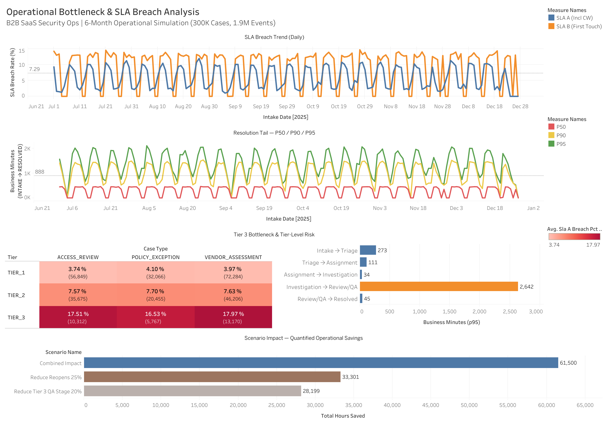
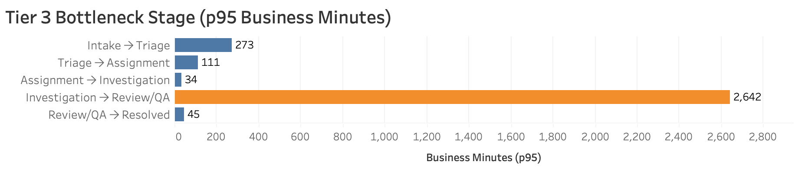
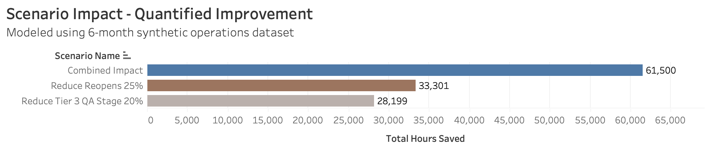

# Operational Bottleneck & SLA Breach Analysis  
**B2B SaaS Security Operations | 6-Month Operational Simulation (~300K Cases, ~1.9M Events)**  

**Live Interactive Dashboard:**  
https://public.tableau.com/app/profile/rama.krishna.pudota/viz/OPSSLA/OperationalBottleneckSLABreachAnalysis  

---

## Dashboard Overview  



---

## Overview  

This project simulates internal Operations Analytics work at a B2B SaaS Security & Compliance company.

Over a six-month operational window, approximately **300,000 security review cases** and **1.9 million event records** were modeled in a local DuckDB warehouse. A **business-hour SLA engine (Mon–Fri, 08:00–18:00, holiday-adjusted)** was implemented to evaluate performance, isolate bottlenecks, and quantify operational improvement levers.

Two SLAs were analyzed:

- **SLA B (First Touch):** 2 business hours  
- **SLA A (First Resolution):** 24 business hours  

All SLA logic, bottleneck analysis, and scenario modeling were implemented in SQL. Tableau is used strictly for visualization of curated mart tables.

---

## Key Findings  

### Tier Is the Primary Breach Driver  

- **Tier 1 SLA A breach rate:** ~3–4%  
- **Tier 2 SLA A breach rate:** ~7–8%  
- **Tier 3 SLA A breach rate:** ~16–18%  

Tier 3 exhibits roughly **2–3× higher breach rates** than Tier 2.  
Case type variation exists, but **tier complexity is the dominant driver of SLA risk**.


---

### Tail Latency Drives SLA Exposure  

Tier 3 **p95 resolution time:** ~2,642 business minutes.  

Median performance remains stable, but breach exposure is concentrated in **extreme tail cases**.

Resolution volatility is structural rather than random noise.



---

## Bottleneck Identified  

Stage-level cycle time decomposition shows that the **Investigation → Review/QA** stage dominates p95 resolution time.

This downstream process constraint is the **primary operational bottleneck** driving SLA A breaches.

---

## Policy Sensitivity (Customer Wait Treatment)  

SLA A breach rates shift materially depending on policy definition:

- **Including Customer Wait:** ~6.6%  
- **Paused During Customer Wait:** ~2.7%  

Reporting definition alone can change perceived performance by nearly **four percentage points**.

---

## Scenario Modeling — Quantified Operational Impact  

Three counterfactual scenarios were modeled using case-level business-minute metrics.

### Scenario 1: Reduce Tier 3 Investigation → Review/QA Duration by 20%  

- Eligible cases: 8,243  
- SLA A breaches avoided: 1,003  
- Operational hours saved: ~28,199 hours  

---

### Scenario 2: Reduce Reopens by 25%  

- Eligible reopened cases: 13,791  
- Rework hours saved: ~33,301 hours  

---

### Combined Impact  

- **Total operational hours saved:** ~61,500 hours  

Reopen reduction lowers operational workload but does not directly reduce first-resolution SLA breach rates, since SLA A is measured from intake to first resolution.



---

## Architecture and Implementation  

### Technology Stack  

- DuckDB (local warehouse simulation)  
- Python 3.11  
- SQL (PostgreSQL-style syntax)  
- Pandas  
- NumPy  
- Tableau Public  

---

## Data Model  

### Raw Layer  
- `cases` (~300K rows)  
- `events_log` (~1.9M rows)  
- `staffing_schedule`  
- `calendar_dim`  

### Staging Layer  
- Canonical event timestamps  
- Business-minute time spine  
- Milestone derivation  
- SLA metrics  

### Mart Layer  
- `sla_daily`  
- `sla_by_tier_case_type`  
- `driver_stage_durations`  
- `congestion_daily`  
- `scenario_results`  

All business logic resides in SQL. Tableau consumes curated mart tables only.

---

## Dashboard Components  

- SLA Breach Trend (Daily)  
- Resolution Tail Percentiles (P50 / P90 / P95)  
- Tier × Case Type Risk Heatmap  
- Tier 3 Bottleneck Stage Decomposition  
- Scenario Impact — Quantified Operational Savings  

The dashboard is structured to answer four executive questions:

1. Are we breaching?  
2. Where is risk concentrated?  
3. Which stage drives tail latency?  
4. What measurable improvement is achievable?  

---

## Reproducibility  

To regenerate the full pipeline locally:

```bash
python -m src.s2_generate_and_load --mode full
python -m src.s3_raw_qa
python -m src.s4_build_staging
python -m src.s5_build_sla_engine
python -m src.s6_build_marts
python -m src.s7_driver_analysis
python -m src.s8_scenario_modeling
python -m src.s9_export_for_tableau
